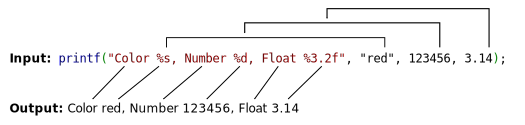

# C - printf


* [**Secrets of printf**](https://drive.google.com/file/d/1J3xpbP4E5qNNkjgYjJrISJlgp4ZSAUSm/view?usp=share_link)
* [man printf (3)](https://man7.org/linux/man-pages/man3/printf.3.html)


### functions and macros employed (see man page)
* write
* malloc
* free
* va_start
* va_end
* va_copy
* va_arg

### Compilation
```
$ gcc -Wall -Werror -Wextra -pedantic -std=gnu89 *.c
```
### General
* All c files are [betty](https://github.com/holbertonschool/Betty) compliance
* All function prototype are included in the header file [main.h](./main.h)

## Tasks
|type | File | Description |
|-----|------|-------------|
folder | [test](./test) | folder contains all tests files (cases) including the main function developed specifically for the program
